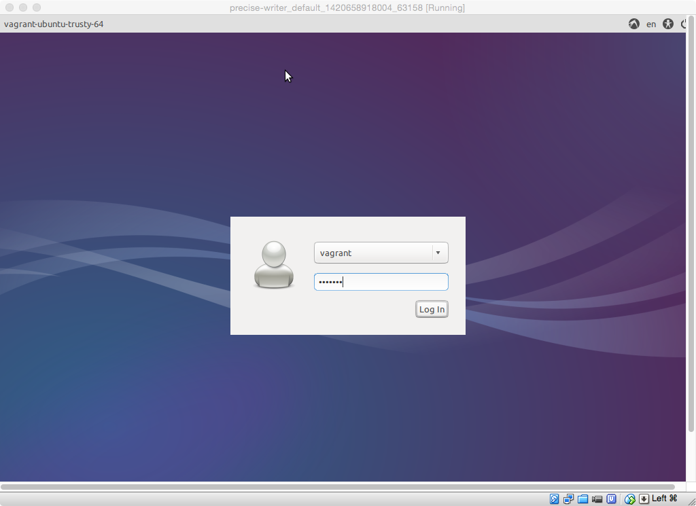

precise-writer
==============

An Ubuntu 12.04 VM for writing with citedown

## Initial build and configuration

From a terminal on your host machine, run

    vagrant up
    
When the build has completed, use the GUI login window shown below to login (password `vagrant`).

Double click the icon labelled "Set up Desktop", then logout (using the "gear" icon at the
top right of the window, and log back in.  Your launcher bar should be configured like the one 
shown below, with icons for Retext (a markdown editor), JEdit (a validating XML editor), and
a terminal.  (You can trash the "Set up Desktop" icon at this point.)

